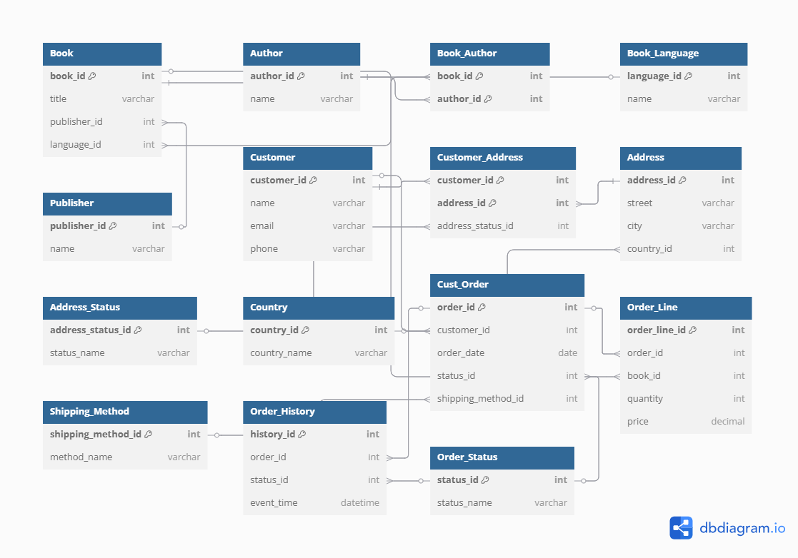

# Bookstore-database

# Bookstore Database Project

This is a group project for the Database Design & Programming with SQL module. The project involves building a fully functional MySQL database for a bookstore — from table design to data insertion, user access control, and testing via queries.

---

## Group Members & Responsibilities

| **Sadaf** (Group Leader) | Database Architect & GitHub Manager | 

- Created the GitHub repository  
- Designed and created tables: `book`, `author`, `book_language`, `publisher`, `book_author`  
- Wrote insert data and inserted sample data
- Added user accounts for all team members  
- Reviewed all work in `bookstore.sql`
- Designed ER Diagram
  
| **Patricia**   | Developer |  
- Created: `customer`, `address`, `country`, `address_status`, `customer_address`  
- Inserted sample customer, address, and country data  
- Handled foreign key relationships
- Designed ER Diagram
  
| **Jackline**   | Developer |  
- Created: `cust_order`, `order_line`, `order_history`, `shipping_method`, `order_status`  
- Inserted order-related data  
- Tracked order history
- Designed ER Diagram

---

## Project Files

- `bookstore.sql` – Contains everything:  
  - Database and table creation  
  - Sample data insertion  
  - User accounts with remote access  
  - Test queries
- `README.md` – This file

---

## Entity Relationship Diagram

The following diagram illustrates the database structure for our bookstore system:

